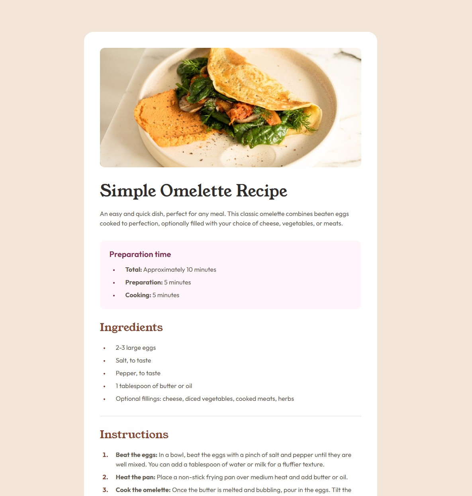

# Frontend Mentor - Recipe Page Solution

This is my solution to the [Recipe page challenge on Frontend Mentor](https://www.frontendmentor.io/challenges/recipe-page-KiTsR8QQKm). The goal of this challenge was to build a responsive recipe page as close as possible to the provided design.

## Table of contents

* [Overview](#overview)

  * [Screenshot](#screenshot)
  * [Links](#links)
* [My process](#my-process)

  * [Built with](#built-with)
  * [What I learned](#what-i-learned)
  * [Continued development](#continued-development)
  * [AI Collaboration](#ai-collaboration)
* [Author](#author)

## Overview

### Screenshot



### Links

* Solution URL: [GitHub Repository](https://github.com/shigureyn/recipe-page)
* Live Site URL: [Live Site](https://shigureyn.github.io/recipe-page/)

## My process

### Built with

* Semantic HTML5 markup
* CSS custom properties
* Mobile-first workflow
* Responsive layout
* Local fonts with `@font-face`
* CSS table styling
* Accessible table markup with `caption`, `th`, and `scope="row"`

### What I learned

While working on this project, I practiced building a clean and semantic HTML structure for a recipe page. I used sections for the main content blocks, lists for ingredients and instructions, and a table for the nutrition information.

One important part was improving the structure of the nutrition table:

```html
<tr class="nutrition__table-row">
  <th class="nutrition__table-label" scope="row">Calories</th>
  <td class="nutrition__table-value">277kcal</td>
</tr>
```

I also practiced writing mobile-first CSS and then adapting the layout for larger screens with media queries.

```css
@media (min-width: 768px) {
  .recipe-card {
    max-width: 46rem;
    margin: 0 auto;
    padding: 2.5rem;
    border-radius: 1.5rem;
  }
}
```

### Continued development

In future projects, I want to continue improving:

* Writing cleaner and more consistent class names
* Building mobile-first layouts faster
* Using semantic HTML correctly
* Improving accessibility for tables, images, and page sections
* Matching design spacing, typography, and layout more accurately

### AI Collaboration

I used ChatGPT during this project as a learning assistant. It helped me review the HTML structure, improve semantic markup, understand table accessibility, organize CSS, and write a cleaner mobile-first responsive stylesheet.

I reviewed the suggestions and adjusted the code myself to better understand the decisions behind the structure and styling.

## Author

* GitHub - [@shigureyn](https://github.com/shigureyn)
* Frontend Mentor - [@shigureyn](https://www.frontendmentor.io/profile/shigureyn)
